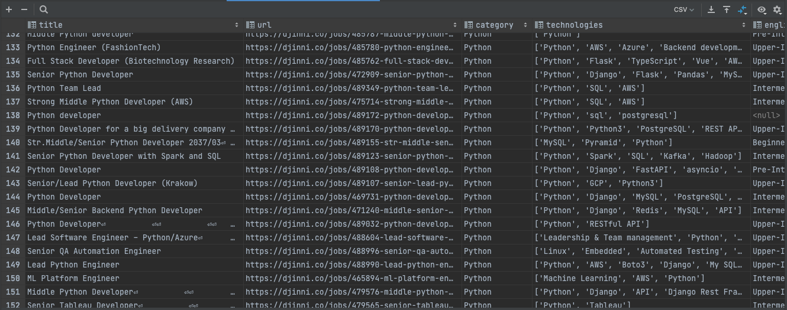
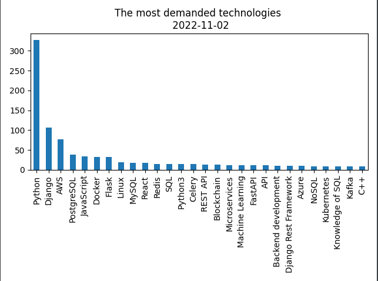

# Djinni-Scraper

The idea of Djinni Scraper is to help you to understand the most demanded technologies on the tech market right now

## Installation

Python must be already installed

```shell
git clone https://github.com/anatomst/Djinni-Scraper.git
python3 -m venv venv
source venv/bin/activate (on Linux and macOS) or venv\Scripts\activate (on Windows)
pip install -r requirements.txt

# to get csv file with all python vacancies (~20 seconds)
python3 djinni_parser.py

# to get graphic bar
python3 python data_python.py "*csv_file" 
# *csv_file - csv file you want to convert to bar
# example: python data_python.py "python_vacancies-2022-11-02-18:2.csv" 
# now you have png in data_png directory
```

## Screenshots 



